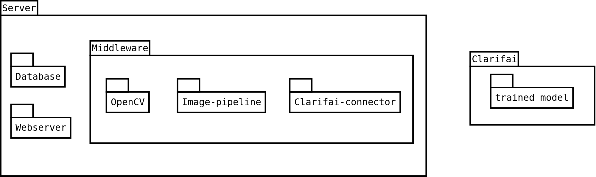

## SmartFridge
# Software Design Document
Names: Melanie, Liuba, Nils, Jörn, Chris  

## Revision History
| Version 	| Date		| Commentary									|
|---------------|---------------|-------------------------------------------------------------------------------|
| 0.0		| 2017-12-19	| Initial Template									|

## TABLE OF CONTENTS
1. [INTRODUCTION](#1-introduction)
        
	1.1 [Purpose](#11-purpose)
        
	1.2 [Scope](#12-scope)
        
	1.3 [Overview](#13-overview)
        
	1.4 [Reference Material](#14-reference-material)
        
	1.5 [Definitions and Acronyms](#15-definitions-and-acronyms)

2. [SYSTEM OVERVIEW](#2-system-overview)

3. [SYSTEM ARCHITECTURE](#3-system-architecture)

	3.1 [Architectural Design](#31-architectural-design)

	3.2 [Decomposition Description](#32-decomposition-description)

	3.3 [Design Rationale](#33-design-rationale)

4. [DATA DESIGN](#4-data-design)

	4.1 [Data Description](#41-data-description)
		
	4.2 [Data Dictionary](#42-data-dictionary)

5. [COMPONENT DESIGN](#5-component-design)

6. [HUMAN INTERFACE DESIGN](#6-human-interface-design)

	6.1 [Overview of User Interface](#61-overview-of-user-interface)

    6.2 [Screen Images](#62-screen-images)

	6.3 [Screen Objects and Actions](#63-screen-objects-and-actions)

7. [REQUIREMENTS MATRIX](#7-requirements-matrix)

8. [APPENDICES](#8-appendices)

## 1. INTRODUCTION
##### 1.1 Purpose
~~Identify the purpose of this SDD and its intended audience. (e.g. “This software design document describes the architecture and system design of XX. ….”).~~

This software design document describes the architecture and system design of the SmartFridge project  that accompanies the Systems and Software Engineering class.

##### 1.2 Scope
~~Provide a description and scope of the software and explain the goals, objectives and benefits of your project. This will provide the basis for the brief description of your product.~~

The software serves as a prototype or MVP (minimum viable product) to the overarching idea of a system that tracks content inside a consumer fridge. As such its scope is reduced to identify two distinct fruits (bananas and tomatoes) and evaluate their ripeness. This is embedded in a notifaction system for a hypothetical enduser.

##### 1.3 Overview
~~Provide an overview of this document and its organization.~~

This document is subdivided into 6 parts: system overview, system architecture, data design, component design, human interface design and a requirements matrix.

##### 1.4 Reference Material
~~This section is optional.
List any documents, if any, which were used as sources of information for the test plan.~~

##### 1.5 Definitions and Acronyms
~~This section is optional.
Provide definitions of all terms, acronyms, and abbreviations that might exist to properly interpret the SDD. These definitions should be items used in the SDD that are most likely not known to the audience.~~

## 2. SYSTEM OVERVIEW
~~Give a general description of the functionality, context and design of your project. Provide any background information if necessary.~~

Accomplishments from user perspective:
- provide a web interface for the user to interact:
  - show a recent picture of the inside of the fridge
  - show a message about the state of the fridge content
- take a picture and send it to a cloud machine learning application; can be done periodically and on user demand
  - based on the response:
    - bad food: send a notification to a designated slack channel
    - everything ok: stay idle

## 3. SYSTEM ARCHITECTURE
##### 3.1 Architectural Design
Develop a modular program structure and explain the relationships between the modules to achieve the complete functionality of the system. This is a high level overview of how responsibilities of the system were partitioned and then assigned to subsystems. Identify each high level subsystem and the roles or responsibilities assigned to it. Describe how these subsystems collaborate with each other in order to achieve the desired functionality. Don’t go
into too much detail about the individual subsystems. The main purpose is to gain a general understanding of how and why the system was decomposed, and how the individual parts work together. Provide a diagram showing the major subsystems and data repositories and their interconnections. Describe the diagram if required.

###### System architecture overview

##### 3.2 Decomposition Description
Provide a decomposition of the subsystems in the architectural design. Supplement with text as needed. You may choose to give a functional description or an object­oriented description.
For a functional description, put top­level data flow diagram (DFD) and structural decomposition diagrams. For an OO description, put subsystem model, object diagrams, generalization hierarchy diagram(s) (if any), aggregation hierarchy diagram(s) (if any), interface specifications, and sequence diagrams here.

##### 3.3 Design Rationale
Discuss the rationale for selecting the architecture described in 3.1 including critical issues and trade/offs that were considered. You may discuss other architectures that were considered, provided that you explain why you didn’t choose them.

## 4. DATA DESIGN
##### 4.1 Data Description
Explain how the information domain of your system is transformed into data structures.
Describe how the major data or system entities are stored, processed and organized. List any databases or data storage items.

##### 4.2 Data Dictionary
Alphabetically list the system entities or major data along with their types and descriptions. If you provided a functional description in Section 3.2, list all the functions and function parameters. If you provided an OO description, list the objects and its attributes, methods and
method parameters.

## 5. COMPONENT DESIGN
In this section, we take a closer look at what each component does in a more systematic way. If you gave a functional description in section 3.2, provide a summary of your algorithm for each function listed in 3.2 in procedural description language (PDL) or pseudocode. If you gave an OO description, summarize each object member function for all the objects listed in 3.2 in PDL
or pseudocode. Describe any local data when necessary.

## 6. HUMAN INTERFACE DESIGN
##### 6.1 Overview of User Interface
Describe the functionality of the system from the user’s perspective. Explain how the user will be able to use your system to complete all the expected features and the feedback information that will be displayed for the user.

##### 6.2 Screen Images
Display screenshots showing the interface from the user’s perspective. These can be handdrawn or you can use an automated drawing tool. Just make them as accurate as possible.
(Graph paper works well.)

##### 6.3 Screen Objects and Actions
A discussion of screen objects and actions associated with those objects.

## 7. REQUIREMENTS MATRIX
Provide a cross­reference that traces components and data structures to the requirements in your SRS document.
Use a tabular format to show which system components satisfy each of the functional requirements from the SRS. Refer to the functional requirements by the numbers/codes that you gave them in the SRS.

## 8. APPENDICES
This section is optional.
Appendices may be included, either directly or by reference, to provide supporting details that could aid in the understanding of the Software Design Document.
