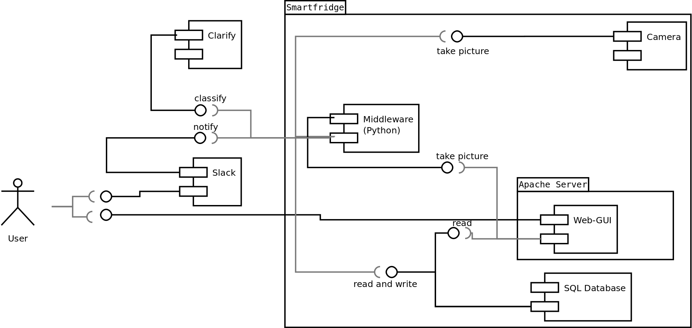

# Software Design Document - SmartFridge

Names: Liuba, Nils, Jörn, Chris

## Revision History

| Version | Date       | Commentary           |
|---------|------------|----------------------|
| 0.0     | 2017-12-19 | Initial Template     |
| 1.0     | 2018-01-26 | Detailed description |

## TABLE OF CONTENTS
1. [Introduction](#1-introduction)
    1. [Purpose](#11-purpose)
    1. [Scope](#12-scope)
    1. [Overview](#13-overview)
    1. [Reference Material](#14-reference-material)
    1. [Definitions and Acronyms](#15-definitions-and-acronyms)
1. [System Overview](#2-system-overview)
1. [System Architecture](#3-system-architecture)
    1. [Architectural Design](#31-architectural-design)
    1. [Decomposition Description](#32-decomposition-description)
    1. [Design Rationale](#33-design-rationale)
1. [Data Design](#4-data-design)
    1. [Data Description](#41-data-description)
    1. [Data Dictionary](#42-data-dictionary)
1. [Component Design](#5-component-design)
1. [Human Interface Design](#6-human-interface-design)
    1. [Overview of User Interface](#61-overview-of-user-interface)
    1. [Screen Images](#62-screen-images)
    1. [Screen Objects and Actions](#63-screen-objects-and-actions)
1. [Requirements Matrix](#7-requirements-matrix)
1. [Appendices](#8-appendices)

## 1. Introduction

### 1.1 Purpose
This software design document describes the architecture and system design of
the SmartFridge project that accompanies the Systems and Software Engineering
class.

### 1.2 Scope
The software serves as a prototype or MVP (minimum viable product) to
the overarching idea of a system that tracks content inside a consumer
fridge. As such its scope is reduced to identify bananas and evaluate
their ripeness. This is embedded in a notification system for a
hypothetical end user.

This prototype is built to conveniently adopt more fruits and other products.

### 1.3 Overview
This document is subdivided into 6 parts: system overview, system architecture,
data design, component design, human interface design and a requirements matrix.

### 1.4 Reference Material
The project has a [Wiki](https://github.com/ndoering/smartfridge/wiki) that
includes the up to date reference material.

## 2. System overview

### Web interface

The website provides the main interaction for the SmartFridge. The
user can request a photo from here to inspect the current state of the
contents of the fridge. The displayed image is accompanied by the state
of the freshness of the fruits within the image in form of a list.
Furthermore, a log is provided to browse previous states of the fridge.

### Notification via Slack channel

If bad food is recognized in the fridge this is reported not only on the
website but also immediately in a predefined Slack channel. The user can therefore
use the Slack app to get the notifications asynchronously.

### Classification of the freshness of fruits

Images are sent to a cloud service to be classified by a machine
learning application. This is done periodically and on user demand.

### Database storage for later use

All images and the classifications received from the cloud
service are stored for displaying it on the website and later logging
purposes. This is facilitated by an on-site database server.

## 3. System architecture

### 3.1 Architectural Design
The prototype of the SmartFridge mainly consists of three layers,
following the MVC (Model-View-Controller) architecture. The model
consists of the SQL-Database server in the backend of the prototype,
storing the images and their classifications. The view is implemented
by a webserver providing the website displaying the current state of
the fridge and by the notifications sent to the Slack channel. The
controlling part consists of a python program (middleware) which regularly takes
images of the fridge's content, preprocesses them, sends them to
Clarifai for classification and to the database for storage.

#### System architecture overview

### 3.2 Decomposition Description

#### Model - Database

We use a *MySQL* database server as the model for our application. This
standard database is installed directly on the Raspberry Pi and runs
as a standalone server in background. We connect to the database with
the *mysql-connector-python* module. This module is provided by the
MySQL project.

The database is comprised of two tables, *fridgelog* and
*all_fruits*. The first table contains all the raw images, their
timestamps and an optional note. The second table stores
parts of the raw camera image, only featuring one fruit within. This
feature is currently not implemented. For each of these parts the
classification (label) is stored, along with the confidence and an
optional note. These part images are referenced via a foreign key to
the corresponding *fridgelog* entry. Therefore, a retrieval all
parts of one image and their respective classifications is possible.

#### View - Webserver

The webserver is a standard *Apache HTTP* webserver. It is provided
by the operating systems package manager. It runs as a standalone
service and provides the website for the SmartFridge.

The website itself is built in *PHP*, *HTML* and *CSS* and optimized for
responsiveness to make it independent of the user's device type. The main
drivers during development are ease of use and simplicity.
It provides a
current image and the corresponding classifications, which are taken
from the database. The website works autonomously and will not be
triggered asynchronously from the controller.

It also provides a button that triggers the controller, currently
using an operating-system-level signal, which is called via the
*pkill* command. This signal induces the controller to provide a new
image and classifications, which will be stored in the database. The
website takes the new image and displays it accompanied by its classifications.

#### Controller - Python middleware

The controller takes the images of the content of the fridge. This is
done via the camera module attached to the Raspberry Pi and the
*picamera* python module. The images are created as binary
representations of *JPEG* images.

The images are then handed over to the image processing pipeline. This
pipeline is a modular chain of processing functions. The type of
processors can be defined via the global configuration
file. The pipeline takes one image at a time, processes it
sequentially and returns the transformed image.

Thereafter, the transformed image is handed to the Clarifai connection
module. This module sends an API call containing the image to Clarifai to have it
classified. The model used for classification can be chosen through the
global configuration. Currently a custom visual recognition model that has
been trained with a series of banana images is used.
The connecting module receives the classification within seconds after sending.

Afterwards the image and its classification are handed over to the
database to be stored.

##### Image processing pipeline

The image processing pipeline is modularly built and can be configured to
needs at hand. The global configuration file specifies the number,
type and order of the processors. Each processor is a separate stage
in the pipeline.

Each processor is an object providing exactly one function. This
*process()* function takes an image, transforms it and returns
it. This SISO (single input, single output) function is chained
together in a list of functions that provides the resulting
transformation. Therefore, even complex transformations can be created
from simple steps.

For the prototype there are two rudimentary examples for presentation
purposes, the *Dummy* and the *GreyScale* processor. A *Dummy* stage
simply returns the image and forwards it. A *GreyScale* stage converts
the colors of the image to a greyscale. It uses *OpenCV* and the
*opencv-python* module for this task. Other processors that could be build
into the pipeline in the future include downscaling and segmentation of fruits.

### 3.3 Design Rationale

#### MVC architecture

The MVC pattern was chosen to reduce the cohesion between parts of the
program. In this design the technologies used can be changed without
affecting other, more stable parts of the program.

Therefore, we have chosen an standalone database server, which is
connected via a single python module. The module can be changed out
completely and therefore facilitate a change in the storage backend.

Furthermore, the webserver, which provides the view is only loosely
coupled with the controller and the model. The connections are
provided by standard tools of the operating system itself.

Therefore, each part of the system can be exchanged or transferred to
other computers. The only part that necessarily must run on the
Raspberry Pi is the image collection using the hardware camera. This
part can easily be extracted from the controller and run as a
separate, standalone server. All the other parts can be migrated to
more powerful machines to accommodate higher processing needs.

#### Image processing pipeline

The pipeline structure, often called Pipes-and-Filter architecture,
facilitates a simple exchange of the stages. This means the pipeline
can be adapted to unique needs for image preprocessing.

The processors in the pipeline are separate objects, that should not
and do not share state. This simplifies possible parallel handling of
multiple images in future versions. Since they are separate objects
they could also be exchanged at runtime. Consequently, one only needs to know
whether the stage currently processes an image and if not, it can be
removed and replaced by another processor.

#### Image classification provider

The image classification is handled by a low-cost provider
(Clarifai). This helps to rapidly deliver a prototype. For future
versions the machine learning can be managed by another provider or by another
program developed by us.

Clarifai was chosen because of three reasons. Firstly, it provides a
simple Python module, that is freely available via the PyPi packaging
system. If necessary, we also could reach Clarifai via REST
calls. Secondly, the first testing results looked promising. We got
reasonable classifications with a high confidence from
Clarifai. Furthermore, the spread in confidence between the highest
ranking class and the next lower ranking class is significant, so
we can easily distinguish and compute the resulting
class. Finally, Clarifai provides a free-of-cost plan for testing
purposes.

## 4. Data design

### 4.1 Data Description
Explain how the information domain of your system is transformed into data
structures.  Describe how the major data or system entities are stored,
processed and organized. List any databases or data storage items.

### 4.2 Data Dictionary
Alphabetically list the system entities or major data along with their types and
descriptions. If you provided a functional description in Section 3.2, list all
the functions and function parameters. If you provided an OO description, list
the objects and its attributes, methods and method parameters.

## 5. Component design
In this section, we take a closer look at what each component does in a more
systematic way. If you gave a functional description in section 3.2, provide a
summary of your algorithm for each function listed in 3.2 in procedural
description language (PDL) or pseudocode. If you gave an OO description,
summarize each object member function for all the objects listed in 3.2 in PDL
or pseudocode. Describe any local data when necessary.

## 6. Human interface design

### 6.1 Overview of User Interface
Describe the functionality of the system from the user’s perspective. Explain
how the user will be able to use your system to complete all the expected
features and the feedback information that will be displayed for the user.

### 6.2 Screen Images
Display screenshots showing the interface from the user’s perspective. These can
be hand drawn or you can use an automated drawing tool. Just make them as
accurate as possible.  (Graph paper works well.)

### 6.3 Screen Objects and Actions
A discussion of screen objects and actions associated with those objects.

## 7. Requirements matrix
Provide a cross­reference that traces components and data structures to the
requirements in your SRS document.  Use a tabular format to show which system
components satisfy each of the functional requirements from the SRS. Refer to
the functional requirements by the numbers/codes that you gave them in the SRS.

### 7.1 Python

We use *python* in version 3.6.

### 7.2 Python modules

| Module                 | Version  |
|------------------------|----------|
| clarifai               | 2.0.32   |
| mysql-connector-python | 8.0.5    |
| slackclient            | 1.1.0    |
| opencv-python          | 3.4.0.12 |
| confiparser            | 3.5.0    |
