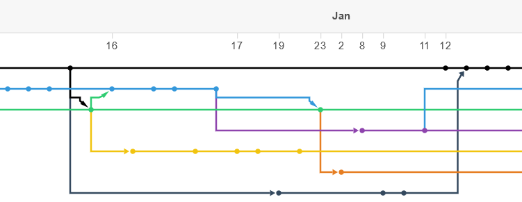
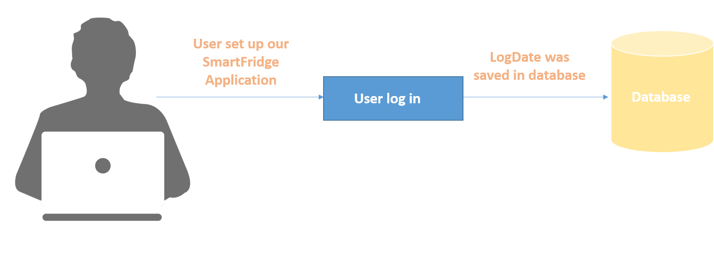
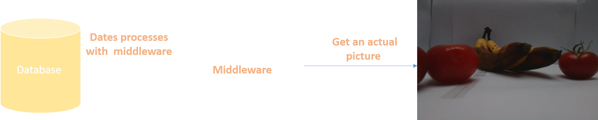
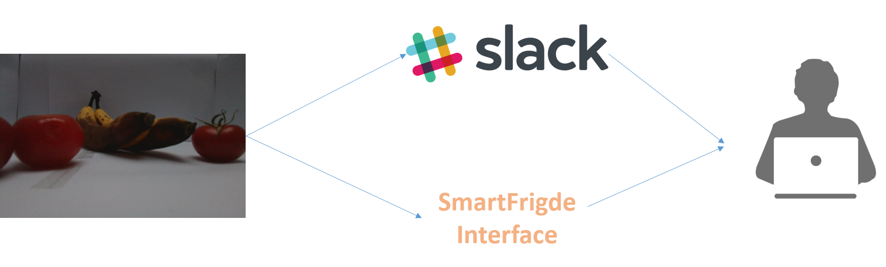
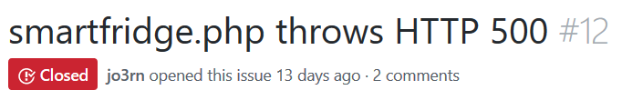
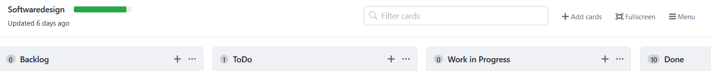
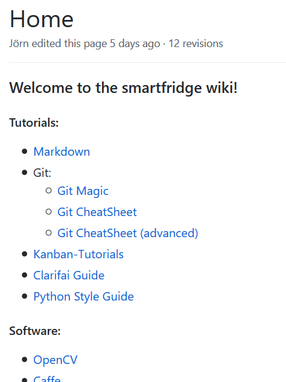

% SmartFridge
% Christian, Jörn, Nils, Liuba
% February 17, 2018

# Agenda

## Agenda

- Project Management
- Requirements
- System Architecture
- Quality
- Live Demo

# Project Management

## Our Software Lifecycle Model

### Evolutionary Prototyping
- Backend scaffold and modules
- Technology required new skills
- Functionality has grown incrementally

## Division of tasks
Determined by software architecture:    

- *Nils Döring*: System Architect & Git advisory 
- *Jörn Wieber*: Clarifai module & Showcase Setup 
- *Liuba Yevtoushenko*: Visual Design 
- *Christian Buchta*: Database & Web Frontend 

## Communication
- Weekly meetings
- Slack messenger
- GitHub
	
## Version control
- GitHub as DVCS
- Branches for each module
- Merging once branches reached final state


# Requirements

## What has been built
- A device that determines the freshness of fruits in a fridge:
     - tracking of the edibility of bananas and tomatoes via optical recognition 
     - reporting regarding the current status of these food items via a web-based user interface and "Slack"
     - RaspberryPi 3 Model B
    
## User Case 1


## User Case 2


## User Case 3
 


# System Architecture

## Main patterns
- MVC pattern
- Client-server pattern
- Pipeline-and-filters pattern
- Minor: Reactor pattern

## MVC pattern
- Model: SQL-Database
- View: PHP website
- Controller: Python program

## Client-server pattern
- Slack
- Clarifai

## Pipeline-and-filters pattern
- Image processing pipeline
- List of processors


# Quality

## Joel Test (1/2)
- Source control
- Fix bugs before writing new code
- Specs (requirements)
- Quiet working conditions
- "Continuous" testing
- PyCharm

## Joel Test (2/2)



## Further measures
- Refactoring
- Code reviews
- Coding standards (PEP8)



# Live Demo

## take photo
```python
import io
import picamera


def take_picture():
    ''' triggers the Pi's camera and returns the images as bytes '''
    
    # create instance of PiCamera class
    camera = picamera.PiCamera()
    
    # flip camera, because it is mounted upside down
    camera.hflip = True
    camera.vflip = True

    # create stream using in-memory byte buffer
    stream = io.BytesIO()
    camera.capture(stream, 'jpeg')
    stream = stream.getvalue()

    camera.close()
    
    return stream
```


## Image Processing Pipeline
```python
import cv2 as c


class PipelineStage(object):
    def __init__(self):
        self.id = None

    def process(self, image):
        return image


class DummyStage(PipelineStage):
    def __init__(self):
        super()
        self.desc = 'Dummy image pipeline stage'

    def process(self, image):
        return image


class GreyScaleStage(PipelineStage):
    def __init__(self):
        super()
        self.desc = 'Greyscale image pipeline stage'

    def process(self, image):
        img = c.imread(image)

        processedImg = c.cvtColor(img, c.BGR2GRAY)
        
        return processedImg


pipelineTypes = {
    'dummy': DummyStage,
    'greyscale': GreyScaleStage,
}


def createStage(stageName):
    return pipelineTypes[stageName]()


class Pipeline(object):
    def __init__(self, stagesList):
        self.stages = []
        for stage in stagesList:
            self.stages.append(createStage(stage))

    def addStage(self, stage):
        self.stages.append(createStage(stage))

    def describe(self):
        for stage in self.stages:
            print(stage.desc)

    def process(self, image):
        curImage = image

        for stage in self.stages:
            curImage = stage.process(curImage)

        return curImage
```
	
	
## Machine Learning API
```python
from clarifai.rest import ClarifaiApp


class ClarifaiCall():
    def __init__(self, key, model, imagebytes):
        # initialize clarifai app
        self.clarifaiApp = ClarifaiApp(api_key=key)
        # initialize trained model
        self.model = self.clarifaiApp.models.get(model)
        self.imagebytes = imagebytes
        self.json = None


    def call(self):
        # ask for JSON and display only label and prediction results
        self.json = self.model.predict_by_bytes(self.imagebytes)['outputs'][0]['data']['concepts']
        return self.json
```


## Slack Bot
```python
class Slackbot():
    def __init__(self, configuration):
        self.configuration = configuration.config
        self.slackClient = SlackClient(self.configuration["SLACK"]["SlackToken"])

		
    def compute_message(self, json):
        CONFIDENCE = 0.6
        for concept in json:
            try:
                if messages[concept['name']]:
                    if concept['value'] >= CONFIDENCE:
                        self.speak(concept['name'])
            except:
                continue
				

    def speak(self, message_type):
        message = get_message(message_type)
        sc.send_message(self.slackClient,
                        self.configuration["SLACK"]["BotName"],
                        self.configuration["SLACK"]["SlackChannel"],
                        message)
```

## Database storage
```python
import mysql.connector as mysqlc
import cli_parser as cp
from datetime import datetime


class MySQLConnector(SQLConnector):
    def __init__(self, host, user, password, database):
        super().__init__()
        self.host = host
        self.user = user
        self.password = password
        self.database = database
        self.cursor = None
        self.db = None
        self.qrl = [] #QueryResultList
        self.dict_label = {
            'banana_fresh':             1,
            'banana_fresh-neutral':     2,
            'banana_neutral':           3,
            'banana_neutral-bad':       4,
            'banana_bad':               5
            }

			
    def connect(self):
        self.db = mysqlc.connect(host=self.host,
                                user=self.user,
                                password=self.password,
                                database=self.database)
        self.cursor = self.db.cursor(buffered=True)
        self.connected = True

		
    def disconnect(self):
        self.db.close()
        self.db = None
        self.cursor = None
        self.connected = False

		
    def db_create_tables(self):
        # Table 'fridgelog' contains one image with all fruits
        self.cursor.execute("CREATE TABLE fridgelog "
                            "(fid INT AUTO_INCREMENT PRIMARY KEY, "
                            "capturetime TIMESTAMP, "
                            "full_image LONGBLOB, "
                            "note CHAR(20))")

							
        # Table 'all_fruits' contains image with one fruit each
        self.cursor.execute("CREATE TABLE all_fruits "
                            "(afid INT NOT NULL AUTO_INCREMENT PRIMARY KEY, "
                            "fid INT, "
                            "half_image LONGBLOB, "
                            "class INT, "
                            "confidence FLOAT, "
                            "note CHAR(20), "
                            "FOREIGN KEY (fid) REFERENCES fridgelog(fid))")

							
    def drop_tables(self):
        self.cursor.execute("DROP TABLES IF EXISTS all_fruits, fridgelog")

		
    def insert_fridgelog(self, data):      
        statement = ("INSERT INTO fridgelog "
                     "(full_image, note) "
                     "VALUES (%s, %s)")

        self.cursor.execute(statement, data)
        self.db.commit()

		
    def insert_all_fruits(self, json):
        statement = ("INSERT INTO all_fruits "
                     "(fid, half_image, class, confidence, note) "
                     "VALUES(%s, %s, %s, %s, %s)")

        # get fid of latest entry in fridgelog
        foreign_key = self.retrieve("MAX(fid)", "fridgelog")[0][0]

        # parse json
        for label in json:
            if label['value'] > 0.7:
                data = (foreign_key,
                        'NULL',
                        self.dict_label[label['id']],
                        label['value'],
                        'this is a note')
                self.cursor.execute(statement, data)
                self.db.commit()
            else:
                break # legit because json response is ordered by value
              

    def retrieve(self, what, where, condition=''):
        ''' returns list of tuples that are rows of the statement result '''
        statement = ("SELECT " + what + " FROM " + where + condition)
        self.cursor.execute(statement)
        rows = []
        for what in self.cursor:
            rows.append(what)
        return rows
```


# future functionalities?

## scenarios
- Include more food items
- Barcode input
- Recommendations for recipes
- Voice assistant integration
- Food sharing
