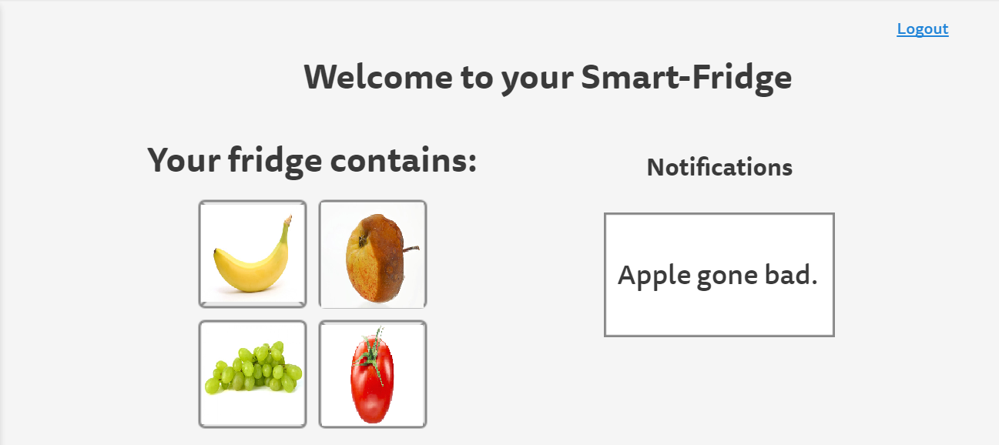

# Requirements Specification for Project 'SmartFridge'
by Melanie, Liuba, Nils, Jörn, Chris   
based on [IEEE SRS Template](http://www.ccc.cs.uni-frankfurt.de/wp-content/uploads/2016/11/srs_template-ieee.doc)

### Table of contents
1. [Introduction](#1introduction)
    1. [Purpose](#11purpose)
    1. [Intended Audience and Reading Suggestions](#12intended-audience-and-reading-suggestions)
    1. [Product scope](#13product-scope)
1. [Overall Description](#2overall-description)
    1.	[Product Perspective](#21product-perspective)
    1.	[Product Functions](#22product-functions)
    1.	[User Classes and Characteristics](#23user-classes-and-characteristics)
    1.	[Operating Environment](#24operating-environment)
    1.	[Design and Implementation Constraints](#25design-and-implementation-constraints)
    1.	[User Documentation](#26user-documentation)
    1. [Assumptions and Dependencies](#27assumptions-and-dependencies)
1.	[External Interface Requirements](#3external-interface-requirements)
    1.	[User Interfaces](#31user-interfaces)
    1.	[Hardware Interfaces](#32hardware-interfaces)
    1.	[Software Interfaces](#33software-interfaces)
    1.	[Communications Interfaces](#34communications-interfaces)
1.	[System Features](#4system-features)
    1.	[Data acquisition and storage](#41-data-aquisition-and-storage)
    1. 	[Detection and tracking of food aging process](#42-detection-and-tracking-of-food-aging-process)
    1.	[Notification of critical food status](#43notification-of-critical-food-status)
1.	[Other Nonfunctional Requirements](#5other-nonfunctional-requirements)
    1.	[Performance Requirements](#51performance-requirements)
    1. 	[Safety Requirements](#52safety-requirements)
    1.	[Security Requirements](#53security-requirements)
    1.	[Software Quality Attributes](#54software-quality-attributes)
    1.	[Business Rules](#55business-rules)
1. 	[Product Vision and further scenarios](#56product-vision-and-further-scenarios)
    1.	[Easier Input for food data](#57easier-input-for-food-data)
    1.	[Recommendations for groceries and recipes](#58recommendations-for-groceries-and-recipes)
    1.	[Delivery service connection and automatic orders](#59Delivery-service-connection-and-automatic-orders)
    1.	[Voice assistant intergration (Siri and Alexa)](#60siri-and-alexa)
    1.	[Social food sharing platform](#61social-food-sharing-platform)
    1.	[Data exchange with other kitchen machines](#62data-exchange-with-other-kitchen-machines)
    1.	[Rethinking the interior fridge design](#63rethinking-the-interior-fridge-design)

## Revision History
| Version 	| Date		| Commentary									|
|---------------|---------------|-------------------------------------------------------------------------------|
| 1.0		| 2017-11-18	| Initial Draft									|
| 2.0		| 2017-11-29	| Updated with Use Cases							|
| 3.0		| 2018-01-02	| Updated with higher goals							|

## 1.	Introduction
##### 1.1	Purpose
~~<Identify the product whose software requirements are specified in this document, including the revision or release number. Describe the scope of the product that is covered by this SRS, particularly if this SRS describes only part of the system or a single subsystem.>~~

This document specifies the software requirements for the SmartFridge project (no release number yet). It describes the entire system.

##### 1.2	Intended Audience and Reading Suggestions
~~<Describe the different types of reader that the document is intended for, such as developers, project managers, marketing staff, users, testers, and documentation writers. Describe what the rest of this SRS contains and how it is organized. Suggest a sequence for reading the document, beginning with the overview sections and proceeding through the sections that are most pertinent to each reader type.>~~

This document is intended for the class of Systems and Software Engineering (WS 2017/2018) at University of Frankfurt. It should be read in whole as each section is relevant for the students' task.

##### 1.3	Product Scope
~~<Provide a short description of the software being specified and its purpose, including relevant benefits, objectives, and goals. Relate the software to corporate goals or business strategies. If a separate vision and scope document is available, refer to it rather than duplicating its contents here.>~~

A device that determines the freshness of food in a fridge. It can optionally be used to track and show the current fridge content. Since we aim to deliver a proof of concept prototype, the examined fruits and vegetables will initially be bananas and tomatoes.

## 2.	Overall Description
##### 2.1	Product Perspective
~~<Describe the context and origin of the product being specified in this SRS. For example, state whether this product is a follow-on member of a product family, a replacement for certain existing systems, or a new, self-contained product. If the SRS defines a component of a larger system, relate the requirements of the larger system to the functionality of this software and identify interfaces between the two. A simple diagram that shows the major components of the overall system, subsystem interconnections, and external interfaces can be helpful.>~~

The described product is a university class project. It can serve as an add-on to fridges already equipped with "smart" technology like a touchpad and internet connection. It can also be used as a stand-alone product. It has a prototype nature and will not be ready to be shipped.

##### 2.2	Product Functions
~~<Summarize the major functions the product must perform or must let the user perform. Details will be provided in Section 3, so only a high level summary (such as a bullet list) is needed here. Organize the functions to make them understandable to any reader of the SRS. A picture of the major groups of related requirements and how they relate, such as a top level data flow diagram or object class diagram, is often effective.>~~

The system's basic functionalities will be:
+ Tracking of freshness and edibility of fruits and vegetables within refrigerators via optical recognition of the food items' changing color and shape.
+ Reporting regarding the current status of these food items via a web-based user interface.
	+ Prediction of a 'best before date'
	+ Statistical overview via one basic chart visualization.

Please take note of the following graphic for the concept.

##### 2.3	User Classes and Characteristics
~~<Identify the various user classes that you anticipate will use this product. User classes may be differentiated based on frequency of use, subset of product functions used, technical expertise, security or privilege levels, educational level, or experience. Describe the pertinent characteristics of each user class. Certain requirements may pertain only to certain user classes. Distinguish the most important user classes for this product from those who are less important to satisfy.>~~

We strive for user-centric systems. Hence we elaborated several user groups that share the following attitudes:

+ Early adaptors. (Technology-savvy and curious users...)
	+ are open-minded and willing to try out unfamiliar products
	+ are likely to provide valuable feedback on functionalities that might be improved or added
	+ appreciate the new product experience as individual benefit
	+ User group importance: high
+ Consciousness about food consumption. Users...
	+ want to have an detailed and exact overview of their food consumption
	+ care about food not being wasted
	+ are most likely to be a long-time user if they are satisfied
	+ benefit the product provides: logs of food consumption
	+ User group importance: high
+ Housewives / Homemakers
	+ are in charge of grocery shopping
	+ like to show off new kitchen equipment to peers (marketing)
	+ benefit the product provides: notifies/reminds on what food needs to be bought
	+ User group importance: medium

##### 2.4	Operating Environment
~~<Describe the environment in which the software will operate, including the hardware platform, operating system and versions, and any other software components or applications with which it must peacefully coexist.>~~

The software will run on a Raspberry Pi 3 Model B with a 1.2GHz Quad Core ARM Cortex-A53, 1 GB LPDDR2 RAM and a WLAN module. Its operating system is Raspbian Stretch (Kernel version 4.9) currently accessible [here](https://www.raspberrypi.org/downloads/raspbian/) and installed on a 16GB SD card.
Attached to it is a camera module with a 5MP sensor that is able to
take pictures with a resolution of 2592 x 1944 (4:3).

A power bank is used for energy supply.

The hardware will operate within the fridge to reduce the overhead of cabling.

##### 2.5	Design and Implementation Constraints
~~<Describe any items or issues that will limit the options available to the developers. These might include: corporate or regulatory policies; hardware limitations (timing requirements, memory requirements); interfaces to other applications; specific technologies, tools, and databases to be used; parallel operations; language requirements; communications protocols; security considerations; design conventions or programming standards (for example, if the customer’s organization will be responsible for maintaining the delivered software).>~~

+ the Raspberry Pi's limited RAM and CPU power might hamper the image processing
+ the knowledge of used programming language(s) might be insufficient
+ the camera module has no auto focus
+ the inside of the fridge is usually not illuminated while the fridge is closed
+ putting the Pi into the fridge for a longer period will be harmful due to humidity and temperature

##### 2.6	User Documentation
~~<List the user documentation components (such as user manuals, on-line help, and tutorials) that will be delivered along with the software. Identify any known user documentation delivery formats or standards.>~~

Currently no user documentation is planned. We aim to build a user interface that is user friendly enough to be self-explanatory.

##### 2.7	Assumptions and Dependencies
~~<List any assumed factors (as opposed to known facts) that could affect the requirements stated in the SRS. These could include third-party or commercial components that you plan to use, issues around the development or operating environment, or constraints. The project could be affected if these assumptions are incorrect, are not shared, or change. Also identify any dependencies the project has on external factors, such as software components that you intend to reuse from another project, unless they are already documented elsewhere (for example, in the vision and scope document or the project plan).>~~

It is assumed that some open-source machine learning libraries and packages are available to facilitate the development and coding process.

### 3.	External Interface Requirements

##### 3.1	User Interfaces
~~<Describe the logical characteristics of each interface between the software product and the users. This may include sample screen images, any GUI standards or product family style guides that are to be followed, screen layout constraints, standard buttons and functions (e.g., help) that will appear on every screen, keyboard shortcuts, error message display standards, and so on. Define the software components for which a user interface is needed. Details of the user interface design should be documented in a separate user interface specification.>~~

The web-based user interface enables the user to view the content of his refrigerator shelf via a browser. The user may enter additional data about the food manually or by scanning the barcode, if there is additional data available the program analyzes this data. The user can view an up-to-date picture of his fridge content. Additionally in a later release there will be charts visualizing the average time a food category stays edible in this fridge comparing it to mean values. This information is also presented in the form of recommendations like turning the temperature up or down. The system also includes a social feature, which enables the user to challenge himself with connected users (disciplines could be maximum days before something goes bad or health challenges like 3 fruits eaten a day) and to function as a food sharing platform. For the food sharing the user can select items which are then visible to users in the area.

##### 3.2	Hardware Interfaces
~~<Describe the logical and physical characteristics of each interface between the software product and the hardware components of the system. This may include the supported device types, the nature of the data and control interactions between the software and the hardware, and communication protocols to be used.>~~

The camera is attached to the CSI-2 (Camera Serial Interface Type 2) of the Raspberry Pi via cable. The power bank is plugged in to the micro-USB port of the Raspberry Pi. Output will be displayed over Wi-Fi on user devices with a browser.
TBD - A Barcode Scanner will be necessary.

##### 3.3	Software Interfaces
~~<Describe the connections between this product and other specific software components (name and version), including databases, operating systems, tools, libraries, and integrated commercial components. Identify the data items or messages coming into the system and going out and describe the purpose of each. Describe the services needed and the nature of communications. Refer to documents that describe detailed application programming interface protocols. Identify data that will be shared across software components. If the data sharing mechanism must be implemented in a specific way (for example, use of a global data area in a multitasking operating system), specify this as an implementation constraint.>~~

The backbone of our system will be a picture recognition and freshness prediction software. The output regarding status and predictions will be accessible via a web-based user interface. Hence, for the sake of efficiency it is feasible to host this website on a local web service within the Raspberry Pi along with our analytics software.

##### 3.4	Communications Interfaces
~~<Describe the requirements associated with any communications functions required by this product, including e-mail, web browser, network server communications protocols, electronic forms, and so on. Define any pertinent message formatting. Identify any communication standards that will be used, such as FTP or HTTP. Specify any communication security or encryption issues, data transfer rates, and synchronization mechanisms.>~~

The Raspberry Pi is equipped with a Wi-Fi interface. Thus it is able to offer the web interface provided by a local web server service via a local Wi-Fi connection. In order to provide a high radio accessibility range, the Raspberry Pi might be connected to a local access point. Alternatively, it could also be configured as access point itself and deliver a one-to-one connection with the end user device, such as a smartphone or laptop computer.

### 4.	System Features
~~<This template illustrates organizing the functional requirements for the product by system features, the major services provided by the product. You may prefer to organize this section by use case, mode of operation, user class, object class, functional hierarchy, or combinations of these, whatever makes the most logical sense for your product.>~~
This section describes the functionalities the system provides. It features the use-cases in the following diagram:

#### 4.1 Data acquisition and storage

###### 4.1.1	Description and Priority
~~<Provide a short description of the feature and indicate whether it is of High, Medium, or Low priority. You could also include specific priority component ratings, such as benefit, penalty, cost, and risk (each rated on a relative scale from a low of 1 to a high of 9).>~~

The camera module placed inside the fridge takes a picture of food items on one shelf.   

Priority: high

###### 4.1.2	Stimulus/Response Sequences
*   User puts fruits in the fridge
*   User activates the SmartFridge software by accessing the user interface via web browser.

###### 4.1.3	Functional Requirements
~~<Itemize the detailed functional requirements associated with this feature. These are the software capabilities that must be present in order for the user to carry out the services provided by the feature, or to execute the use case. Include how the product should respond to anticipated error conditions or invalid inputs. Requirements should be concise, complete, unambiguous, verifiable, and necessary. Use “TBD” as a placeholder to indicate when necessary information is not yet available.>~~

- REQ-1.1: Take picture within fixed environment
- REQ-1.2: Store images durably
- REQ-1.3: Define region-of-interest (ROI) for each image
- REQ-1.4: Provide access to images and metadata (e.g. timestamps, ID, type of fruit, ROI,...) to other processes
- REQ 1.5: Create timeseries of images for unique fruits

#### 4.2 Detection and tracking of food aging process

###### 4.2.1	Description and Priority
The pictures of the food are categorized by their state of freshness. If there are not enough current pictures, it updates this information to the website.
*   The analytics software must consist of components that can provide the following tasks:
	* Taking pictures with the camera
	* Recognize the food items to be tracked
	* Recognize the aging process with picture analytics techniques (which need to be further elaborated)
	* Predict the food's edibility
	* Constantly improving the prediction process: The user must be able to give simple feedback, if the predicted freshness deviates from its actual state of freshness.
*   A Database about different states of freshness must be accessible.   

Priority: high

###### 4.2.2	Stimulus/Response Sequences
*   The images, taken in 4.1, trigger this process.

###### 4.2.3	Functional Requirements
- REQ 2.1: Extract features from ROIs of timeseries of images
- REQ 2.2: Build aging models for different type of fruits
- REQ 2.3: Compute state of age for individual fruit stored
- REQ 2.4: Update model with user input (e.g. "still fresh", "not fresh anymore", ...)
- REQ 2.5: Update notification database

#### 4.3	Notification of critical food status

###### 4.3.1	Description and Priority
If the food has matured significantly the user gets alerted.   

Priority: medium

###### 4.3.2	Stimulus/Response Sequences
*   The outcomes of 4.2 trigger this event.

###### 4.3.3	Functional Requirements
The notification system (or the website) must be implemented.

- REQ 3.1: Create database for fruits in fridge
- REQ 3.2: Watch database for updates
- REQ 3.3: Notify frontend (e.g. website, RSS-feed, ...)

### 5.	Other Nonfunctional Requirements

##### 5.1	Performance Requirements
~~<If there are performance requirements for the product under various circumstances, state them here and explain their rationale, to help the developers understand the intent and make suitable design choices. Specify the timing relationships for real time systems. Make such requirements as specific as possible. You may need to state performance requirements for individual functional requirements or features.>~~

- REQ N1.1: Modular setup to facilitate separation of computing and
  data acquisition
- REQ N1.2: Reduce energy consumption to less than 25% of the energy
  consumption of the fridge
- REQ N1.3: Minimize exhaust heat that would increase the fridge cooling

##### 5.2	Safety Requirements
~~<Specify those requirements that are concerned with possible loss, damage, or harm that could result from the use of the product. Define any safeguards or actions that must be taken, as well as actions that must be prevented. Refer to any external policies or regulations that state safety issues that affect the product’s design or use. Define any safety certifications that must be satisfied.>~~

- REQ N2.1: Prevent shortlinks within electronics in the fridge environment
- REQ N2.2: Prevent condensation within power supply

##### 5.3	Security Requirements
The data regarding the fridge content must be only accessible by the fridge-owner.

- REQ N3.1: Prevent unauthorized access to stored data
- REQ N3.2: Prevent unauthorized access to computing hardware
- REQ N3.3: Prevent unauthorized access to connected networks and computers

##### 5.4	Software Quality Attributes
~~<Specify any additional quality characteristics for the product that will be important to either the customers or the developers. Some to consider are: adaptability, availability, correctness, flexibility, interoperability, maintainability, portability, reliability, reusability, robustness, testability, and usability. Write these to be specific, quantitative, and verifiable when possible. At the least, clarify the relative preferences for various attributes, such as ease of use over ease of learning.>~~

The software must consume few enough resources to work on a system-on-chip. If this is unattainable, the software must be portable to a different environment. To prevent a bad user experience it also must deliver results quickly.

##### 5.5	Business Rules
~~<List any operating principles about the product, such as which individuals or roles can perform which functions under specific circumstances. These are not functional requirements in themselves, but they may imply certain functional requirements to enforce the rules.>~~

- REQ N5.1: User controls data storage and usage

### 6. Product Vision and further scenarios

Even though the SmartFridge project is still in a very early stage with limited functional capabilities, we share a long-term vision of a of a socially connected food management platform. Our proof-of-concept highlights that a software project can rely in decisive parts on the usage of external webservices. Hence, we expect further opportunities for more sophisticated scenarios that go far beyond our current scope. Following, our list of further ideas should illustrate some of the most likely features we aim to implement next.

##### 6.1	Easier Input for food data
Bearing in mind the current ease of image recognition services, we see significant potential in better user experience by scanning the actual product barcode. SmartFridge could be able to determine the actual grocery items, along with their price and best before dates. Hence, it could determine specific patterns concerning the edibility of fruits from specific origins. A desirable scenario would be information about the actual value of current groceries inside the fridge and elaborated statistical insights on the amount of food that spoiled.

##### 6.2   Recommendations for groceries and recipes
We also believe that the main purpose of data analytics is to make users aware of things they would not realize on the spot. Hence, SmartFridge should extensively deliver recommendations concerning the users' nutritional habits and suggest possible improvements. By granting access to users' personal calendars, or even fitness wearables, the quality of recommendations could be adjusted even more precisely according to the actual health state.

##### 6.3   Delivery service connection and automatic orders
In the advent of grocery delivery services such as Amazon fresh, SmartFridge could automate the entire grocery shopping process. Users would benefit by saving their time from crowded supermarkets and stressful queuing. Moreover, SmartFridge could forecast precisely the amount of food needed and reduce the amount of spoiled food.

##### 6.4   Voice assistant intergration (Siri and Alexa)
Although voice-based assistants currently show many signs of a classic hype, we believe that in the long term voice assistants will be a central part of many people's lives. Hence, we aim to integrate SmartFridge soon with the capabilities to allow voice assistants insights into our system. Necessary interfaces will be provided.

##### 6.5   Social food sharing platform
SmartFridge could be integrated into food sharing platforms. Users could allow to share data on current groceries that are unlikely to be eaten and share these information with nearby SmartFridge users in town. Since cooking is among the most social activities, we believe a related social platform offers high potential to save food and bring people together.  

##### 6.6   Data exchange with other kitchen equipment
Kitchen machines like Thermomix show the trend towards cooking automation. Connecting these tools with SmartFridge could bring new opportunities for connected cooking.

##### 6.7   Rethinking the interior fridge design
Once the entire grocery order process chain and the actual cooking becomes more and more automated it might be appropriate to rethink the actual interior design of a refrigerator. There might be ways to improve the cooling efficiency. Moreover, we could think of automating the refilling process as well.
